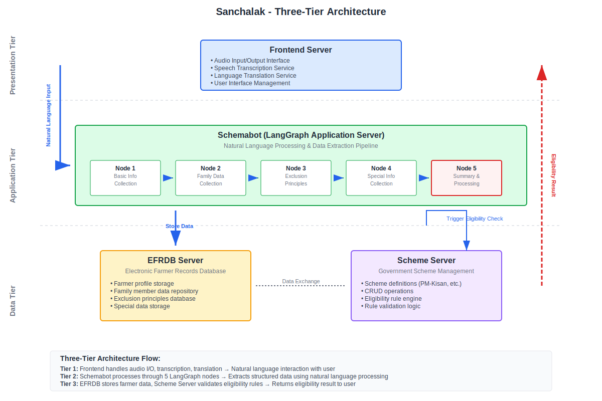

# Sanchalak - Unified Government Scheme Eligibility System



## Overview
Sanchalak is a robust, modular platform for conversational data collection, eligibility checking, and scheme management for government benefit programs (e.g., PM-KISAN). It integrates LLM-driven chat, scheme logic, and data storage, and is designed for extensibility, reliability, and real-world deployment.

---

## Features
- **Conversational AI**: Multilingual, voice-enabled chat for data collection and eligibility.
- **Scheme Management**: Canonical scheme definitions, Prolog-based eligibility, and dynamic field extraction.
- **Modular Architecture**: Decoupled services for UI, API, data, and orchestration.
- **LLM Integration**: Pluggable LLM backend (LM Studio, Qwen2-57B-Instruct, etc.).
- **Production-Ready**: Dockerized, scalable, and easy to deploy.

---

## Architecture
See the full architecture diagram: [`docs/sanchalak_architecture.svg`](docs/sanchalak_architecture.svg)

- **UI Frontend**: Next.js/React, multilingual, voice-enabled chat.
- **UI Backend**: Node.js GraphQL server for audio, TTS, and chat integration.
- **Schemabot**: Python GraphQL API for conversational data extraction and eligibility.
- **Scheme Server**: Python FastAPI, Prolog, and MongoDB for scheme logic and canonical models.
- **EFR Server**: Python FastAPI for farmer registry and CRUD operations.
- **LM Studio**: LLM inference (Qwen2-57B-Instruct or compatible).
- **MongoDB**: Data storage for scheme server and EFR.

---

## Quick Start

### 1. **Local Development**
```bash
# Install Python and Node.js dependencies
pip install -e src
cd src/app/new_ui && npm install && cd ../../..

# Start all services
bash start_sanchalak.sh
```
- Access the UI: [http://localhost:3000](http://localhost:3000)
- All service endpoints and logs are printed in the terminal.

### 2. **Docker Compose (Production/Server)**
```bash
docker-compose up --build
```
- All services (UI, APIs, MongoDB, LM Studio) are orchestrated automatically.
- Configure environment variables in `docker/.env`.

---

## Service Endpoints
- **UI Frontend**: [http://localhost:3000](http://localhost:3000)
- **UI Backend**: [http://localhost:3001](http://localhost:3001)
- **EFR Server**: [http://localhost:8001](http://localhost:8001)
- **Scheme Server**: [http://localhost:8002](http://localhost:8002)
- **Schemabot GraphQL**: [http://localhost:8003/graphql](http://localhost:8003/graphql)
- **LM Studio**: [http://localhost:1234](http://localhost:1234)
- **MongoDB**: [mongodb://localhost:27017](mongodb://localhost:27017)

---

## Directory Structure
```
/README.md
/docker-compose.yml
/docker/                # All Dockerfiles and Docker env
/src/
  app/new_ui/           # Next.js frontend and Node.js backend
  schemabot/            # Python GraphQL API (chat, extraction)
  scheme_server/        # Python FastAPI + Prolog + MongoDB
  efr_server/           # Python FastAPI (farmer registry)
  pipeline/             # Data extraction, normalization, etc.
  translation/          # (Optional) Translation APIs
/docs/                  # Architecture, project docs, cards
/data/                  # Data download scripts
/notebooks/             # EDA, results, figures
```

---

## Environment Variables
- All sensitive keys and service URLs are managed via `.env.local` (for dev) and `docker/.env` (for Docker).
- See the sample in `docker/.env` for all required variables.

---

## Documentation
- See [`docs/`](docs/) for:
  - Architecture diagram
  - Project card and summary
  - Detailed service and API documentation
  - Scheme definitions and canonical models

---

## Contributing
- Fork, branch, and submit PRs.
- Please keep code modular and document new features.

---

## License
MIT (c) AnnamAI Team 